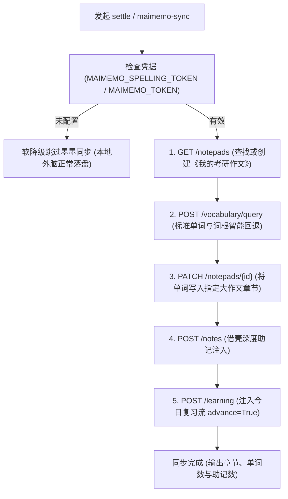

# 考研英语大作文：墨墨背单词开放平台接口契约与助记注入规范 (MaiMemo API Guide)

> **溯源出处与接口标准**：
> - 墨墨开放平台官方标准接口规范（MaiMemo Open API）
> - 同步脚本底层实现：`free-kaoyan-essay-writing/scripts/maimemo_sync.py`
> - 结算主控协同：`free-kaoyan-essay-writing/scripts/kb_manager.py settle`

---

## 一、系统架构定位与词本协同设计

考研英语大作文与小作文在墨墨背单词生态中形成紧密互补的学习闭环：
- **统一专属词本**：大作文与小作文**完全共用同一个云词本**——《我的考研作文》（notepad name: `我的考研作文`）。绝不额外创建新词本，避免学员背单词界面混乱；
- **章节天然物理隔离**：
  - 小作文章节格式：`# [年份][卷别]小作文`（如 `# 2021英一小作文`）；
  - 大作文章节格式：`# [年份][卷别]大作文`（如 `# 2021英一大作文`，脚本默认模板 `# {year}{exam_type_cn}大作文`）。
  两者在同一词本内按真题章节清晰归档，学员既能按篇章专项复习，也能在总词本中统揽考研写作高频核心词汇。

---

## 二、双轨生词卡片设计与借壳助记标准

在每篇大作文结算时，私教提议两类生词卡片（合计 2~4 词，精简克制，宁缺毋滥）：

### 1. 卡片类型 A：初稿错词纠偏卡（`spelling_fix`）
- **选词标准**：学员初稿中出现的拼写错误或易混混淆词（如 `dilemma` 拼成 `dillemma`，`perseverance` 拼成 `perserverance`）；
- **借壳助记结构**：
  ```text
  【考研大作文 · 错词纠偏卡】
  • 初稿误拼：dillemma ➔ 正确拼写：dilemma
  • 考研写作用法：抽象名词，固定搭配 take on a profound overtone of cultural dilemma; face a thorny dilemma
  • 原句语法拆解：[主谓宾主干分析] 作介词 of 的宾语，构成后置定语修饰 overtone
  ```

### 2. 卡片类型 B：范文高阶生词卡（`advanced_vocab`）
- **选词标准**：终版范文中升华引入的高考量学术考纲词汇（如 `overtone`, `foster`, `propel`, `undermine`, `pivotal`）；
- **借壳助记结构**：
  ```text
  【考研大作文 · 核心学术表达】
  • 议论文高阶语义：弦外之音、深层隐喻（抽象名词）
  • 考研写作黄金搭配：take on a profound overtone of [Theme] (呈现出……的深层隐喻)
  • 范文原句主干剖析：[主干立骨架] This visual narrative (主语 S) + takes on (谓语 V) + a profound overtone (宾语 O)
  ```

---

## 三、接口调用链路与权限容灾机制

大作文同步脚本（`maimemo_sync.py`）调用墨墨开放平台四大核心接口，并内置完备的容灾策略：



### 1. 403 权限未开通软降级机制（Phrases Endpoint Bypass）
- 墨墨开放平台的 `/phrases`（专属例句接口）为商业高级受限接口，多数普通个人 Token 无写入权限，直接请求会导致 HTTP 403 Forbidden；
- **架构决策**：系统全面启用**“借壳助记注入（`/notes`）”**方案，将作文原句、翻译、语法拆解与写作搭配全部完整封装进 `/notes` 自定义助记中，彻底停用无谓的 `/phrases` 探测，彻底根除 403 焦虑与报错阻断。

### 2. 词形智能回退算法（Stemming Fallback）
- 当范文中的生词为复数名词（如 `overtones`）或规则动词变形（如 `fragmented`, `proliferated`），若 `/vocabulary/query` 首次查询无果，脚本底层自动执行两级词根智能回退：
  - 过去分词/过去式：去除 `ed` / `d`；
  - 复数形式：去除 `es` / `s`；
  - 确保 100% 匹配到标准考纲单词的原型 `voc_id`。

### 3. 今日复习流即时激活（`advance=True`）
- 单词成功加入词本并注入助记后，脚本立即调用复习队列接口，开启 `advance=True`；
- 学员退出练习后打开手机上的“墨墨背单词” App，新词立即出现在今日复习队列最前方，达成“即写、即纠、即背”的沉浸式无缝体验。

---

## 四、阶段 3 settle 载荷中 maimemo 字典规范

在 `settle.json` 中，`maimemo` 字段格式严格契合如下规范：

```json
{
  "maimemo": {
    "chapter": "2021英一大作文",
    "words": [
      {
        "spelling": "dilemma",
        "type": "spelling_fix",
        "misspelling": "dillemma",
        "sentence": "Evidently, this subtle visual narrative takes on a profound overtone of cultural dilemma.",
        "translation": "显然，这幅精妙的画面叙事呈现出文化困境的深层弦外之音。",
        "usage_note": "考研高频抽象名词，常搭 face a dilemma, cultural dilemma",
        "grammar_note": "介词 of 的宾语，构成后置定语修饰 overtone"
      },
      {
        "spelling": "overtone",
        "type": "advanced_vocab",
        "sentence": "Evidently, this subtle visual narrative takes on a profound overtone of cultural dilemma.",
        "translation": "显然，这幅精妙的画面叙事呈现出文化困境的深层弦外之音。",
        "usage_note": "考研高阶学术名词，常搭 take on a profound overtone of...",
        "grammar_note": "主语 visual narrative + 谓语 takes on + 宾语 overtone"
      }
    ]
  }
}
```
